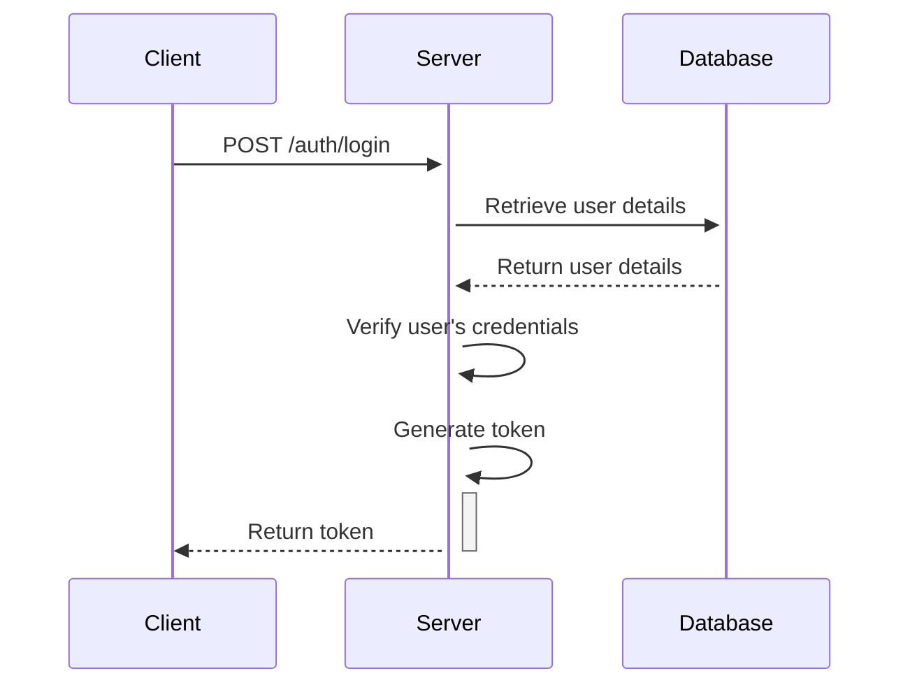

# Login

To authenticate a user, follow these steps: validate the user's credentials, generate a token, and return the token for subsequent authentication.

## Steps to Authenticate a User

1. **Validate User's Credentials:**
    - Ensure that the user has provided the required credentials (e.g., email and password).
    - Retrieve the stored user details from the database using the provided email.

2. **Verify User's Credentials:**
    - Use the stored salt to hash the provided password.
    - Compare the hashed password with the stored hashed password to verify the credentials.

3. **Generate Token:**
    - If the user's credentials are valid, generate a token (e.g., JWT) for the user.
    - This token will be used to authenticate the user in subsequent requests.

## Implementation Details

- Use a secure token generation mechanism to create the authentication token.
- Store the token securely and ensure it has an expiration time to enhance security.

## Login Process

