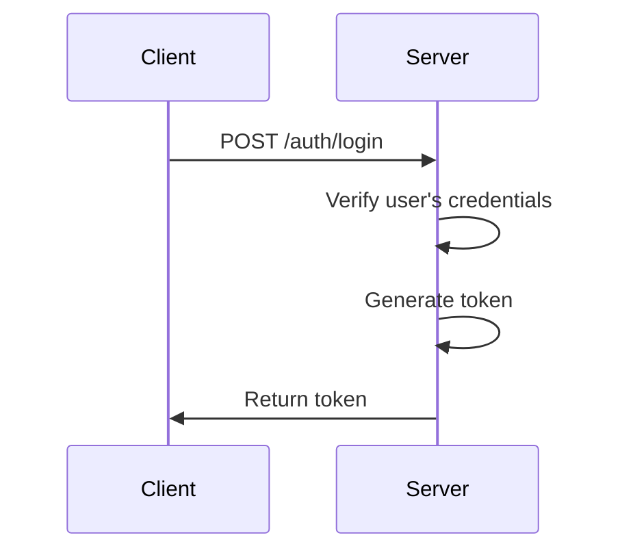
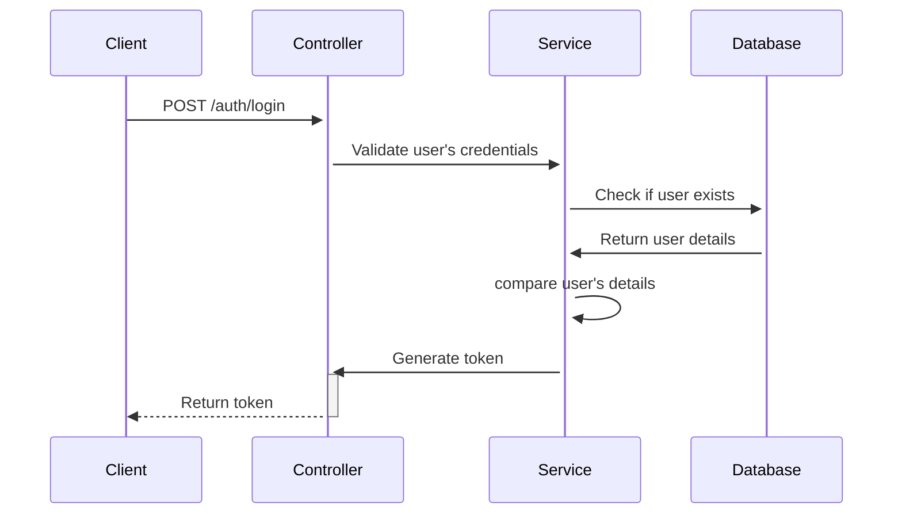

# Login

To authenticate a user, you need to send a POST request to the `/auth/login` endpoint with the user's credentials. The endpoint will return a token that you can use to authenticate the user in subsequent requests.

## Steps to Authenticate a User

1. **Validate User's Credentials**: Ensure that the user has provided the required credentials.

   - **Example**:

     ```json
     {
       "email": "user@example.com",
       "password": "password"
     }
     ```

2. **Send a POST Request**: Send a POST request to the designated endpoint with the user's credentials.

   - **Example**:

     ```http
     POST /auth/login
     Content-Type: application/json

     {
       "email": "user@example.com",
       "password": "password"
     }
     ```

3. **Verify User's Credentials**: Previously, while registering the user, you would have stored the user's credentials in the database. Verify the user's credentials against the stored credentials.

4. **Generate a Token**: If the user's credentials are valid, generate a token for the user.

## Login Process



## Implementation details

1. **DTO**: Create a DTO to represent the user's credentials.

2. **Service**: Create a service to handle the login process.

- **Validate User:**

  - Ensure that the user has provided the required credentials.
  - Check if the user exists in the database.
  - If the user exists, verify the user's credentials.

- **End goal:**
  - If the credentials are valid, generate a token for the user.
  - Else, handle exceptions accordingly.

3. **Controller**: Create a controller to handle the login request.



```

```
