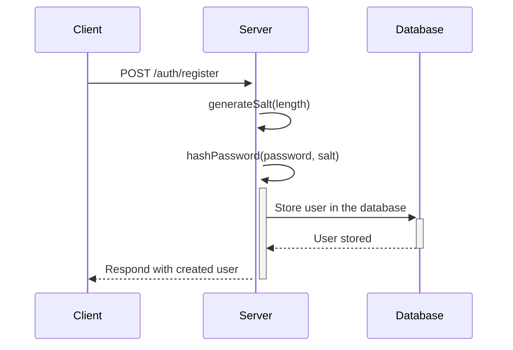

# User Registration

To register a new user, follow these steps: generate a cryptographic salt, hash the user's password with the salt, and store the user details in the database.

## Steps for Creating a User

1. **Generate Salt:**

   - Create a function to generate a cryptographic salt. The salt is a random string used to enhance password security.
   - This function should take a parameter to determine the length of the generated salt.

2. **Hash Password:**

   - Create a function to hash the user's password using the generated salt.
   - Use a secure hashing algorithm like **PBKDF2**, **bcrypt**, or **Argon2**. This function should take the password and salt as parameters and return the hashed password.

3. **Store User:**
   - Create a function to store the user details in the database.
   - This function should take a user object as a parameter. The user object should include the username, email, hashed password, and salt.
   - Ensure the user data is validated before storing it in the database.

## Implementation Details

- Use a cryptographic library to generate the salt and hash the password.
- The database interaction can be done using any database management system (**SQL** or **NoSQL**).

## User Registration Process

