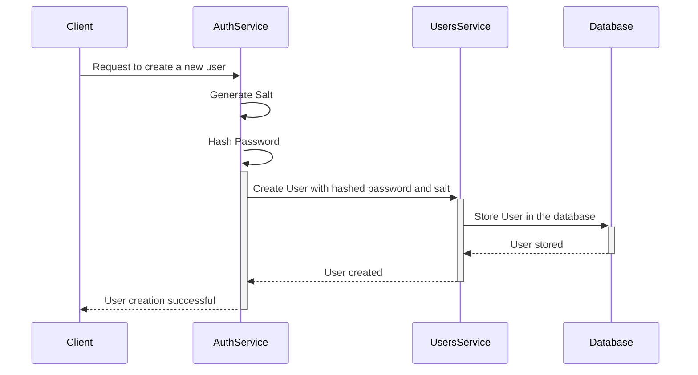

# User Registration

To create a new user, follow these steps: generate a salt, hash the user's password, and store the user in the database using the `UsersService` class.

## Steps for Creating a User

1. **Generate Salt Function**
   - Create a function in the `AuthService` class to generate a cryptographic salt.
2. **Hash Password Function**
   - Create a function in the `AuthService` class to hash a password using the generated salt and the password provided by the client.
3. **Create User Function**
   - Create a function in the `AuthService` class to call the `UsersService` class and create a new user with the hashed password and salt.
   - Ensure the user data is validated before creating the user.

### Implementation Details

- Use the `crypto` module to generate the salt and hash the password.

## User Registration Process

