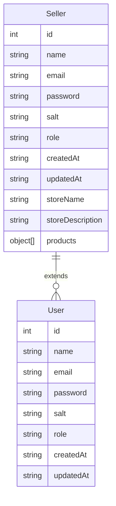

# Users

```mermaid
erDiagram
    Seller {
      int id
      string name
      string email
      string password
      string salt
      string role
      string createdAt
      string updatedAt
      string storeName
      string storeDescription
      object[] products
    }
    Seller ||--o{ User : "extends"
    User {
      int id
      string name
      string email
      string password
      string salt
      string role
      string createdAt
      string updatedAt
    }
```

role===admin differentiate the admin and the user.

an admin can create, update, delete a user
