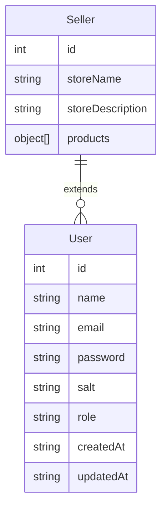
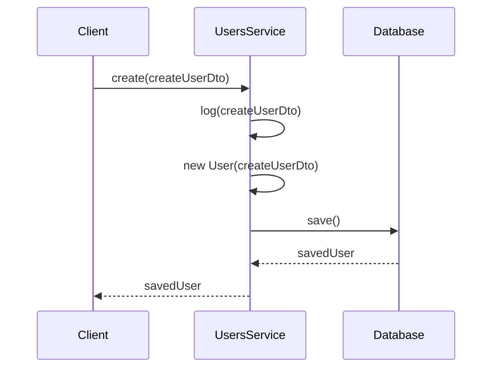

# User Registration

To create a new user, we need the following components:

- **User Schema:** Defines the structure of the user object.
- **User Model:** Interacts with the database and performs CRUD operations.
- **User Service:** Contains logic for creating a new user.

## User Entity



## User Registration Process



<!---->
<!-- role===admin differentiate the admin and the user. -->
<!---->
<!-- an admin can create, update, delete a user -->

```

```
